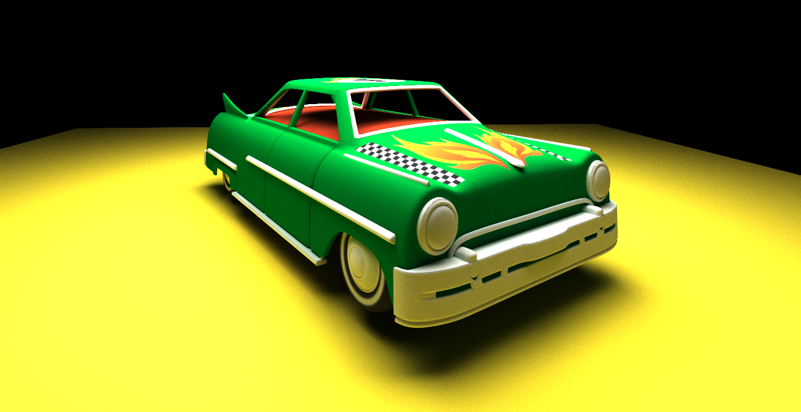
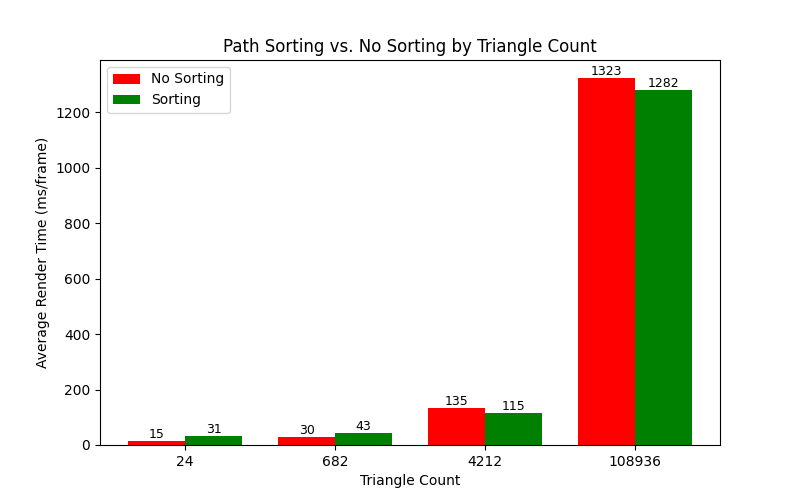
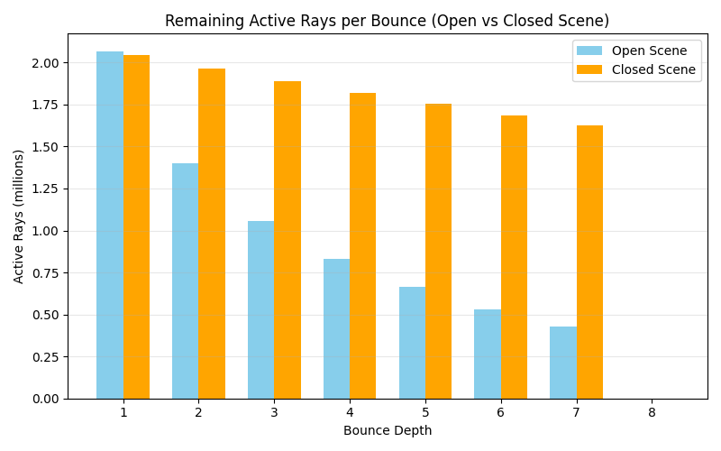
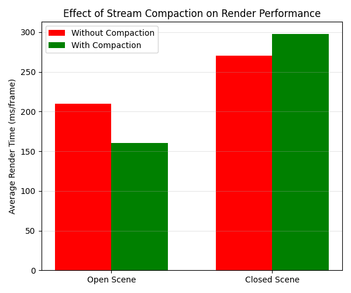
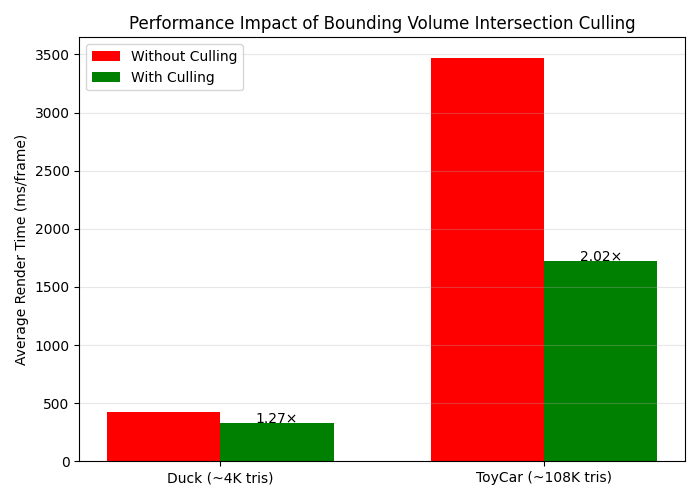
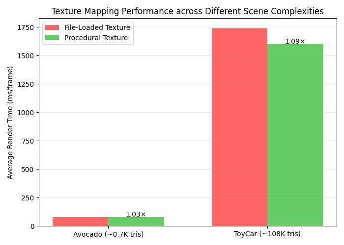
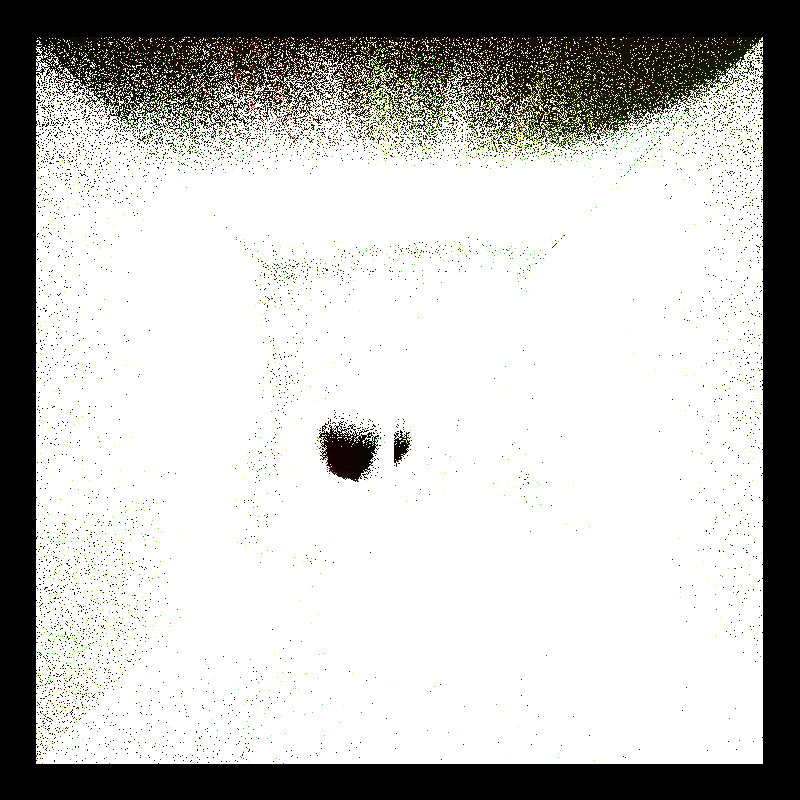
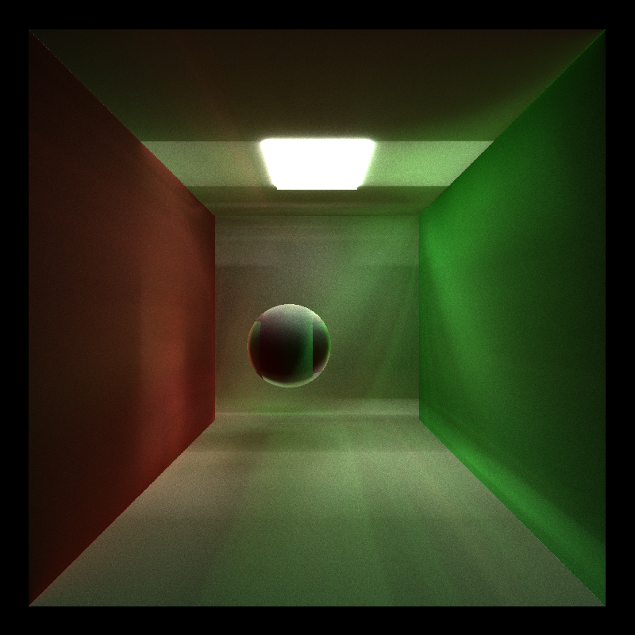

CUDA Path Tracer
================

  

**University of Pennsylvania, CIS 565: GPU Programming and Architecture, Project 3**  
* Ruichi Zhang  
  * [LinkedIn](https://www.linkedin.com/in/ruichi-zhang-537204381/)  
* Tested on: Windows 10, AMD Ryzen 9 7950X3D @ 4201 MHz, 16 Core(s), NVIDIA GeForce RTX 4080 SUPER

## Introduction

This project implements a CUDA-based path tracer capable of rendering physically accurate, globally illuminated images. The renderer supports diffuse BSDF shading, stochastic antialiasing, and performance optimization via path sorting by material type to improve GPU coherence.  
It also supports arbitrary mesh loading and texture mapping, allowing complex 3D models with realistic surface details to be rendered within the same unified framework.

## Basic Shading

Two main shading models are implemented:
- **Diffuse shading** — uses cosine-weighted hemisphere sampling to model ideal Lambertian reflection, producing soft indirect lighting and color bleeding.
- **Perfect specular shading** — reflects rays deterministically about the surface normal, enabling mirror-like materials with sharp highlights.

| Diffuse | Specular |
|:--:|:--:|
|  |  |

## Anti-aliasing

To reduce jagged edges and sampling noise at object boundaries, I implemented stochastic anti-aliasing.   For each pixel, multiple rays are randomly jittered within the pixel area, resulting in smoother image gradients and more realistic soft transitions.
This approach effectively mitigates aliasing artifacts that are especially visible on high-contrast edges or thin geometry in early renders.

| With Anti-Aliasing | Without Anti-Aliasing |
|:--:|:--:|
|  |  |

## Path Sorting

### Implementation
In the shading stage, different materials require different BSDF evaluations, leading to warp divergence when multiple materials are processed within a single CUDA kernel. To mitigate this, path sorting is implemented by material type before shading. Each path is sorted by its `materialId` using `thrust::sort_by_key`.

### Performance Evaluation
To evaluate the effect of path sorting, I tested four scenes of increasing geometric complexity — **Box, Avocado, Duck, and ToyCar** — where both triangle count and material variety gradually increase and the result is shown in Figure 1.

  

  <strong>Figure 1.</strong> Path sorting impact across different scenes <em>(lower is better).</em>

In the **simpler** meshes (Box and Avocado), the **unsorted version performed slightly faster**, since the sorting overhead outweighed any potential coherence gain. However, for the more **complex** meshes (Duck and ToyCar), **path sorting provided a modest speedup**, as the increased number of triangles and materials introduced more divergence in the shading kernel.  

By grouping rays with the same material, sorting reduced warp divergence and improved execution coherence, resulting in better overall GPU efficiency in these multi-material scenes.

## Stream Compaction

### Implementation

During path tracing, many rays terminate early due to hitting light sources, reaching the background, or falling below a throughput threshold. If we keep processing these terminated rays, GPU threads waste cycles executing meaningless computations.

To address this, I implemented stream compaction using `thrust::partition` to remove inactive rays from the path segment buffer after each bounce. This ensures that subsequent bounces operate only on active rays, improving efficiency and reducing divergence. After each bounce, only the surviving rays (i.e., those not yet terminated) are kept for the next iteration.

### Experiment Setup
To evaluate the impact of stream compaction, two scenes were tested — an **open Cornell box** and a **closed Cornell box**.  
Both scenes contain identical geometry, materials, and camera parameters, with the only difference being the presence of a front wall in the closed version. Each scene was rendered with the same number of samples per pixel and path depth (8 bounces) to ensure fairness.

For each bounce, the number of remaining active paths was recorded, and the average render time (ms/frame) was measured using CUDA events. This allowed analysis of how stream compaction affects both ray termination behavior and overall performance in different scene configurations.

  

  <b>Figure 2.</b> Active rays vs. bounce depth (Open vs Closed scene).  

  

  <b>Figure 3.</b> Render time comparison with and without stream compaction <em>(lower is better)</em>.

### Analysis
The effect of stream compaction was evaluated by comparing open and closed Cornell box scenes.   As shown in Figure 2, the number of active paths in the open scene decreases rapidly with each bounce depth, while the closed scene shows almost no reduction. This indicates that stream compaction is more effective in open scenes, where rays are more likely to escape and terminate early.

Figure 3 further confirms this observation in terms of performance. With stream compaction enabled, the open scene achieves roughly a 30% speedup compared to the baseline, whereas the closed scene shows a slight slowdown. This is likely due to the extra overhead introduced by the compaction step when few rays terminate early.

## GLTF Mesh Loading

### Overview

To support rendering of arbitrary meshes, I implemented glTF mesh loading with texture support. The system parses `.gltf` files via `tinygltf` and constructs GPU buffers for vertex positions, normals, texture coordinates, and material data. This enables complex, realistic models to be rendered with detailed surface appearance and albedo textures.

Compared to the original path tracer that only supported basic primitives (spheres and cubes), glTF loading allows the renderer to handle millions of triangles, greatly improving visual realism.

| Avocado | Duck |
|:--:|:--:|
|  |  |

### Bounding Volume Intersection Culling
Loading and shading glTF meshes introduce additional computational cost due to numerous triangle intersection tests. To maintain performance, I integrated bounding volume intersection culling acceleration structures, reducing intersection checks by first checking rays against a volume that completely bounds the mesh.

To evaluate the effect of bounding volume intersection culling, performance was measured on two glTF mesh scenes of different geometric complexity.

  

  <b>Figure 4.</b> Performance improvement from bounding volume intersection culling across different scenes (<i>lower is better</i>).

As shown in Figure 4, in the smaller Duck scene (~4K triangles), culling achieved a **1.27×** speedup, while in the larger ToyCar scene (~108K triangles), the improvement reached approximately **2×**.

This trend indicates that the benefit of culling scales with scene complexity.  By first testing each ray against a bounding volume that tightly encloses the mesh, many unnecessary ray–triangle intersection tests are skipped early. In simpler models, this overhead only provides moderate gains, but as triangle count increases, the number of intersections avoided grows substantially, making bounding volume culling a highly effective and scalable optimization for complex meshes.

## Texture Mapping

To support textured materials in glTF meshes, texture mapping is implemented. Textures are loaded from image files and bound to CUDA texture objects (`cudaTextureObject_t`), allowing hardware-accelerated sampling directly from GPU memory. This enables efficient per-pixel albedo, normal, and roughness lookups during shading, improving visual richness without excessive computation.

In addition to image-based textures, a simple procedural checkerboard texture was implemented for testing and debugging purposes.

| Base Texture | Checker Texture |
|:--:|:--:|
|  |  |

To compare the performance of file-loaded (basic) and procedural textures, both methods were evaluated under the same rendering configuration.

  

  <b>Figure 5.</b> Performance comparison between file-loaded and procedural texture mapping in different scenes (<i>lower is better</i>).

The performance comparison between **file-loaded** and **procedural** textures across two glTF mesh scenes shows that procedural textures are consistently faster. In the simpler Avocado scene (~0.7K triangles), procedural mapping achieves a **1.03×** speedup, while in the more complex ToyCar scene (~108K triangles), the improvement increases to **~1.09×**.

This trend suggests that the overhead of texture fetching and sampling from GPU memory becomes slightly more pronounced in high-complexity scenes, though CUDA texture object caching effectively mitigates the cost. Procedural textures remain lightweight due to purely arithmetic color generation, but file-based textures offer superior visual realism with only a minor performance trade-off.

## Bloopers

  

  <b>Figure 6.</b> Incorrect light processing.

  

  <b>Figure 7.</b> Wrong use of random number generator.

## References
- [tinygltf](https://github.com/syoyo/tinygltf)
- [Vulkan glTF PBR Samples](https://github.com/SaschaWillems/Vulkan-glTF-PBR)
- [glTF Tutorial (Khronos Group)](https://github.khronos.org/glTF-Tutorials/gltfTutorial/)
- [glTF Sample Assets](https://github.com/KhronosGroup/glTF-Sample-Assets)
- [CUDA Texture Object API](https://docs.nvidia.com/cuda/cuda-runtime-api/group__CUDART__TEXTURE__OBJECT.html)
